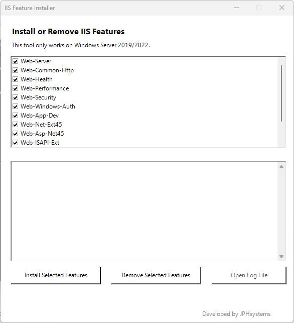

# 🌐 IIS Feature Installer GUI

A professional GUI tool to **install or remove IIS features** on Windows Server 2019/2022, built in PowerShell with support for `.exe` conversion via `ps2exe`.

---

## 🖥️ Features

✅ Install preselected IIS features  
✅ Remove selected IIS features  
✅ Visual log window and saved log file  
✅ Windows Server version check  
✅ Reboot prompt if required  
✅ Branded footer: `Developed by JPHsystems`  
✅ Compatible with `.exe` conversion  

---

## 🎨 GUI Preview



---

## 🛠️ Requirements

- Windows Server **2019** or **2022**
- Windows PowerShell 5.1 (not PowerShell Core / 7)
- Administrator rights to install/remove features

---

## 🚀 How to Use

### 1. **Run the Installer**

> 📁 If using the `.ps1` script:
```powershell
Right-click → Run with PowerShell (as Administrator)
